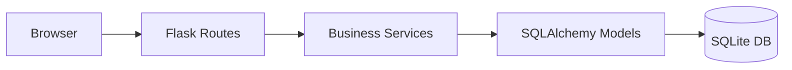

# Architecture

## Overview

RestoPoS follows the Model-View-Controller (MVC) pattern implemented with Flask.



## Components

### Models (`src/models.py`)

SQLAlchemy ORM models representing the database schema:

- **MenuItem**: Food items with name, category, price
- **Customer**: Customer records with auto-generated reference IDs
- **Order**: Orders linking customers to items
- **OrderItem**: Line items in an order
- **Payment**: Payment records with receipt numbers

### Services (`src/services.py`)

Business logic layer:

- Subtotal calculation
- Tax calculation (18%)
- Service charge (1%)
- Reference ID generation

### Routes (`src/routes.py`)

Flask blueprint handling HTTP requests:

- Authentication (login/logout)
- Customer registration
- Order creation
- Payment processing
- Receipt generation

### Templates (`templates/`)

Jinja2 HTML templates with Bootstrap 5 styling.

## Database Schema

```
MenuItem
├── id (PK)
├── name
├── category
├── price
└── available

Customer
├── id (PK)
├── name
├── phone
├── address
├── reference_id (unique)
└── created_at

Order
├── id (PK)
├── customer_id (FK → Customer, nullable)
├── reference_id (unique)
├── status
└── created_at

OrderItem
├── id (PK)
├── order_id (FK → Order)
├── menu_item_id (FK → MenuItem)
├── quantity
└── unit_price

Payment
├── id (PK)
├── order_id (FK → Order)
├── subtotal
├── tax_rate
├── tax_amount
├── service_charge
├── total
├── payment_method
├── paid_at
└── receipt_number (unique)
```

## Request Flow

1. User accesses `/login`
2. Credentials validated (demo: admin/admin)
3. Session created, redirect to `/dashboard`
4. From dashboard: New Customer, New Order, Logout
5. Order flow: Select items → Place order → Payment → Receipt

## Configuration

Environment variables via `.env`:

- `FLASK_SECRET_KEY`: Session encryption key
- `DATABASE_URL`: SQLAlchemy database URI (default: sqlite:///pos.db)
- `FLASK_ENV`: development/production
